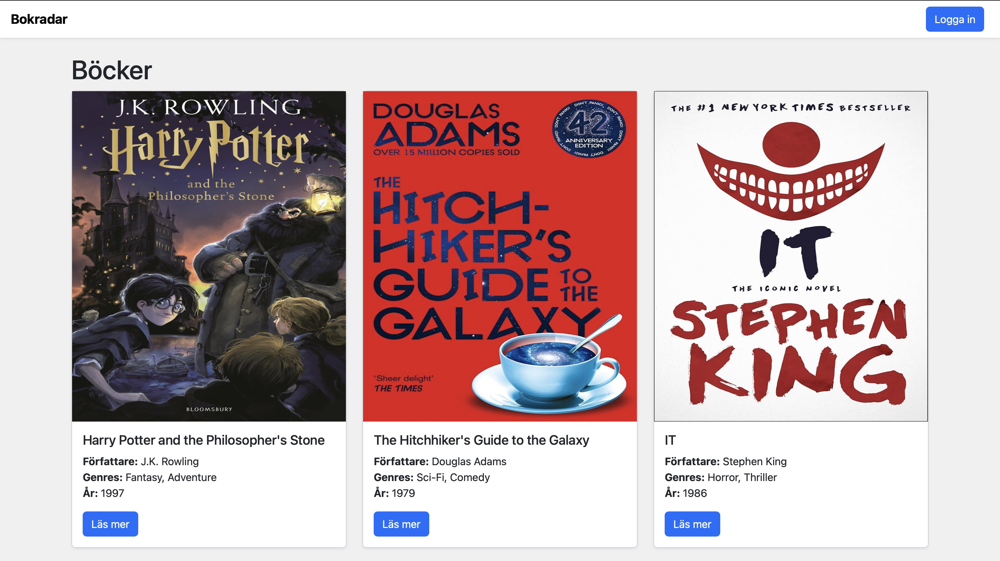

# Bokradar

Detta grupprojekt är ett fullstack‑system byggt med **Express + TypeScript + MongoDB**, där vi skapar ett Book API med tre tabeller: **users**, **books** och **reviews**, samt en klient med både öppna och lösenordsskyddade sidor.



## Innehåll

- Tekniker
- Flöde
- Databasstruktur
- Installation & körning
- API-endpoints
- Klient sidor

## Tekniker

- Express — Backend‑ramverk för routing och API‑logik
- TypeScript — Själva koden
- Node.js — Runtime‑miljö för att köra Express‑servern
- MongoDB - Dataserver med cluster
- Insomnia — API‑klient för att testa endpoints
- Bootstrap - UI-ramverk för klienten

## Flöde


## Databas

Databasen innehåller tabellerna:

### `users`

- username: String
- password: String (bcrypt‑hashad)
- is_admin: Boolean
- created_at: Date

### `books`

- title: String
- description: String
- author: String
- genres: Array
- image: String
- published_year: Number

### `reviews`

- name: String
- content: String
- rating: Number (1-5)
- created_at: Date
- book_id: ObjectId

### Relation

- En **book** kan ha flera **reviews**
- En **review** tillhör exakt en **book**
- Kopplingen sker via `book_id` i recensionen, som refererar till bokens `_id`.

## Installation och körning

1. Klona projektet och installera dependencies:

```bash
   npm install
```

3. Skapa en .env fil med följande:

```env
MONGODB_URL =
JWT_SECRET =
NODE_ENV =

```

5. Eventuellt ändra till annan port i `index`om det behövs:

```typescript
const PORT = 3000;
```

6. Starta dev-server:

```bash
 npm run dev
```

## Endpoints

Nedan följer alla endpoints för Users och Böcker.

### Users

| Metod  | Endpoint           | Beskrivning         |
| ------ | ------------------ | ------------------- |
| GET    | /api/users         | Hämta alla users    |
| GET    | /api/users/:id     | Hämta enskild user  |
| POST   | /api/auth/register | Skapa användare     |
| PATCH  | /api/users/:id     | Uppdatera användare |
| DELETE | /api/users/:id     | Radera användare    |

### Autentisering

| Metod | Endpoint | Beskrivning           |
| ----- | -------- | --------------------- |
| POST  | /auth    | Hämta alla kategorier |

### Books

| Metod  | Endpoint       | Beskrivning          |
| ------ | -------------- | -------------------- |
| GET    | /api/books     | Hämta alla böcker    |
| GET    | /api/books/:id | Hämta bok + reviews  |
| POST   | /api/books     | Skapa bok            |
| PATCH  | /api/books/:id | Uppdatera bok        |
| DELETE | /api/books/:id | Radera bok + reviews |

### Reviews

| Metod  | Endpoint         | Beskrivning             |
| ------ | ---------------- | ----------------------- |
| GET    | /api/reviews     | Hämta alla reviews      |
| GET    | /api/reviews/:id | Hämta en enskild review |
| POST   | /api/reviews     | Skapa en review         |
| PATCH  | /api/reviews/:id | Uppdatera en review     |
| DELETE | /api/reviews/:id | Radera en review        |

## Klient sidor

### Öppna sidor

- index.html - Listar alla böcker
- Visar bland annat bokbild, titel, författare, publiceringsår och genrer.
- Varje bok länkar vidare till den specifika boksidan.
- Har en knapp för att gå till inloggningssidan.

Tillhörande JavaScript:

- `js/index.js` hämtar och visar böcker från API:et.

#### Boksida – book.html

- Visar vald boks bild, titel, författare, publiceringsår, genrer och beskrivning.
- Läser bokens ID från adressen, exempelvis `book.html?id=...`.
- Har en tillbakalänk till boklistan.
- Visar bokens recensioner med namn, text, betyg och datum.
- Har ett formulär för att skapa en recension med namn, text och betyg 1–5.
- Recensioner kan skapas utan inloggning.
- Hämtar boken och recensionerna igen efter att en ny recension sparats.

Tillhörande JavaScript:

- `js/book.js` hämtar och visar bokens uppgifter.
- `js/review.js` visar recensioner och hanterar reviewformuläret.

### Auth sidor

Registrering – register.html

- Innehåller ett formulär för att registrera en ny användare.
- Användaren anger användarnamn och lösenord.
- Skickar uppgifterna till `/api/auth/register`.
- Lösenordet hashades med bcrypt innan användaren sparas i databasen.
- Visar ett meddelande om registreringen lyckas eller misslyckas.

Tillhörande JavaScript:

- `js/login.js` hanterar inloggningen.

Inloggning – login.html

- Innehåller ett formulär för inloggning med användarnamn och lösenord.
- Skickar uppgifterna till `/api/auth/login`.
- Vid lyckad inloggning skapas en JWT som sparas i en httpOnly-cookie.
- Användaren skickas vidare till `loggedin.html` efter lyckad inloggning.
- Visar ett felmeddelande om inloggningen misslyckas.

Tillhörande JavaScript:

- `js/login.js` hanterar inloggningen.

### Skyddad sida

Inloggad panel – loggedin.html

- Kan endast visas för inloggade användare.
- Kontrollerar inloggningen genom att anropa en skyddad endpoint med JWT-cookien.
- Om användaren inte är inloggad skickas användaren till inloggningssidan.
- Listar alla användare i tabellform med:
  - användarnamn
  - adminstatus
  - datum då användaren skapades
- Listar böcker i tabellform.
- Innehåller formulär för att lägga till nya böcker.
- Har en knapp för att logga ut.
- Vid utloggning tas JWT-cookien bort och användaren skickas tillbaka till startsidan.

Tillhörande JavaScript:

- `js/loggedin.js` hanterar innehållet på den skyddade sidan och utloggningen.
- `js/functions.js` innehåller gemensamma funktioner/variabler som används av klienten.
