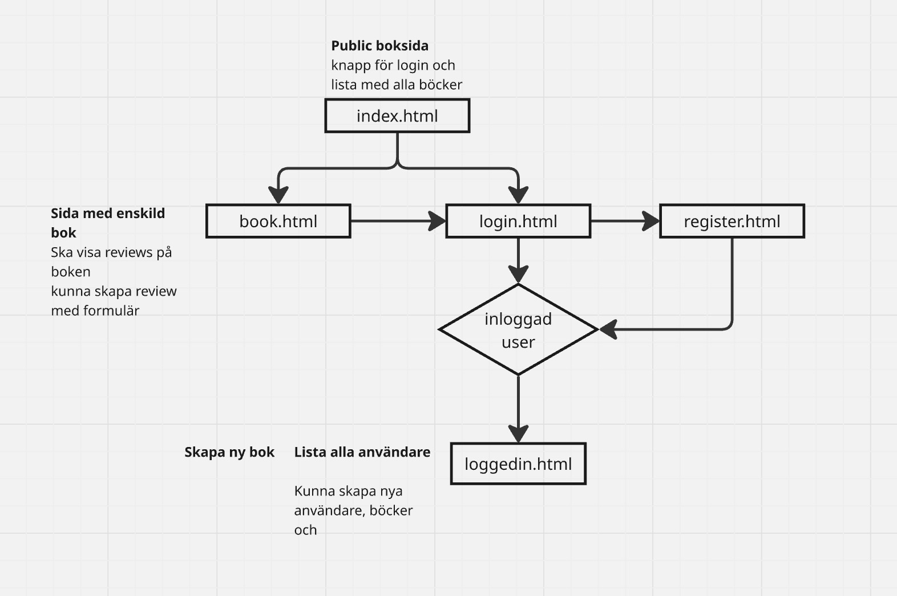

# Gruppuppgift2 (kom på namn)

Detta grupprojekt är ett fullstack‑system byggt med **Express + TypeScript + MongoDB**, där vi skapar ett Book API med tre tabeller: **users**, **books** och **reviews**, samt en klient med både öppna och lösenordsskyddade sidor.

## Innehåll

- Tekniker
- Flow
- Databasstruktur
- Installation & körning
- API-endpoints
- Klient sidor

## Tekniker

- Express — Backend‑ramverk för routing och API‑logik
- TypeScript — Själva koden
- Node.js — Runtime‑miljö för att köra Express‑servern
- MongoDB - Dataserver med cluster
- Insomnia — API‑klient för att testa endpoints
- Bootstrap - UI-ramverk för klienten

## Flow
 


## Databas

Databasen innehåller tabellerna:

### `users`
- username: String
- password: String (bcrypt‑hashad)  
- is_admin: Boolean 
- created_at: Date


### `books`
- title: String
- description: String
- author: String
- genres: Array
- image: String
- published_year: Number


### `reviews`
- name: String
- content: String
- rating: Number (1-5)
- created_at: Date
- review_id: ObjectId

### Relation

- En **book** kan ha flera **reviews**  
- En **review** tillhör exakt en **book**  
- Kopplingen sker via `review_id` (book_id)

## Installation och körning

1. Klona projektet och installera dependencies:

```bash
   npm install
```


3. Skapa en .env fil med följande:

```env
MONGODB_URL =
JWT_SECRET = 
NODE_ENV = 

```

5. Eventuellt ändra till annan port i `index`om det behövs:

```typescript
const PORT = 3000;
```

6. Starta dev-server:

```bash
 npm run dev
```

## Endpoints

Nedan följer alla endpoints för Users och Böcker.

### Users

| Metod  | Endpoint        | Beskrivning           |
| ------ | --------------- | --------------------- |
| GET    | /categories     | Hämta alla kategorier |


### Autentisering

| Metod  | Endpoint        | Beskrivning           |
| ------ | --------------- | --------------------- |
| POST   | /auth           | Hämta alla kategorier |

### Books

| Metod  | Endpoint       | Beskrivning          |
| ------ | -------------  | -------------------- |
| GET    | /api/books     | Hämta alla böcker    |
| GET    | /api/books/:id | Hämta bok + reviews  |
| POST   | /api/books     | Skapa bok            |
| PATCH  | /api/books/:id | Uppdatera bok        |
| DELETE | /api/books/:id | Radera bok + reviews |

### Reviews

| Metod  | Endpoint      | Beskrivning          |
| ------ | ------------- | -------------------- |
| GET    | /products     | Hämta alla produkter |


## Klient sidor

### Öppna sidor
- index.html - Listar alla böcker
- book.html - Visa specifik bok + review
- Formulär för att skapa review

### Auth sidor
- 
-

### Skyddad sida
- 

